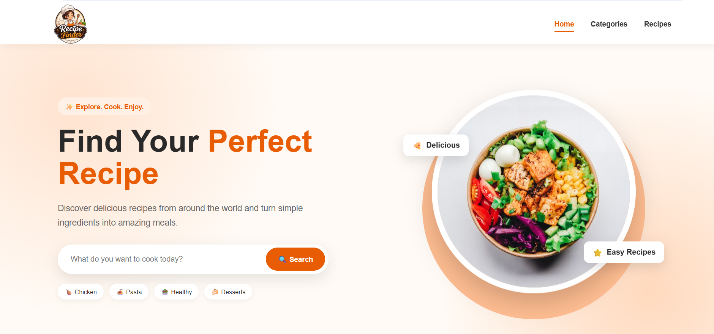

# 🍳 Recipe Finder

A responsive recipe finder web application built with **HTML, CSS, JavaScript, and TheMealDB API** to help users discover delicious recipes quickly and easily.

## 📸 Screenshots

### 🏠 Home Page




## 📖 About the Project

**Recipe Finder** is a responsive web application that allows users to search for recipes and discover detailed meal information using the **TheMealDB API**.

Users can enter a recipe name in the search bar, search for meals, and view the available recipes along with their images and details. The application provides a clean and user-friendly interface that adapts to different screen sizes.

This project was developed to practice **frontend web development, JavaScript, API integration, dynamic content rendering, and responsive web design**.

---

## ✨ Features

* 🔍 Search for recipes by name
* 🍽️ Display matching recipes dynamically
* 🖼️ Display recipe images
* 📖 View recipe details
* 🥕 Display ingredients and measurements
* 📝 Display cooking instructions
* 🌍 Display meal category and cuisine/area
* ✨ Smooth animations and interactive UI elements
* 📱 Fully responsive design
* 🎨 Clean and modern user interface
* ❌ Handles unavailable search results
* ⚡ Fetches recipe data dynamically using an API

---

## 🛠️ Technologies Used

* **HTML5** – Used to structure the application
* **CSS3** – Used for styling, transitions, animations and responsive layout design
* **JavaScript** – Used for application logic, API requests, search functionality, and dynamic content
* **TheMealDB API** – Used to retrieve recipe and meal information
* **Responsive Web Design** – Ensures compatibility across desktop, tablet, and mobile devices

---

## 🔗 API Used

This project uses the **TheMealDB API** to retrieve recipe and meal information.

TheMealDB provides meal data including:

* Meal name
* Meal image
* Meal category
* Cuisine/area
* Ingredients
* Measurements
* Cooking instructions
* Recipe details

The application sends a search request to TheMealDB API and dynamically displays the returned meal information on the webpage.

**API:** TheMealDB

---

## 🔎 How It Works

1. The user enters a recipe name in the search bar.
2. JavaScript captures the search input.
3. A request is sent to the **TheMealDB API**.
4. The API returns matching meal information.
5. JavaScript processes the API response.
6. The matching recipes are dynamically displayed as recipe cards.
7. Users can explore the recipe details, ingredients, and cooking instructions.

---

## 📱 Responsive Design

The application is designed to provide a smooth experience across different screen sizes.

It is responsive for:

* 💻 Desktop
* 💻 Laptop
* 📱 Tablet
* 📱 Mobile

The layout, recipe cards, navigation, search section, and other elements adapt to different screen sizes for better usability.

---


## 🚀 Getting Started

### 1. Clone the Repository

```bash
git clone https://github.com/Sri-1All/Recipe-Finder.git
```

### 2. Navigate to the Project Folder

```bash
cd Recipe-Finder
```

### 3. Run the Application

## 🌐 Live Demo

🔗 [View Recipe Finder](https://sri-1all.github.io/Recipe-Finder/)

## 🎯 Project Goals

The main goals of this project are:

* To build a practical frontend web application
* To practice HTML, CSS, and JavaScript
* To learn how to work with REST APIs
* To implement API-based search functionality
* To dynamically display data using JavaScript
* To create a responsive user interface
* To improve frontend development skills

---

If you found this project interesting, feel free to ⭐ the repository!
